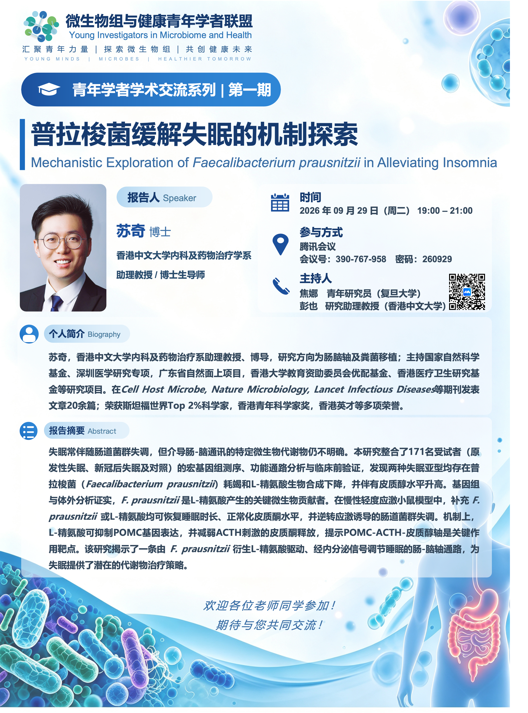
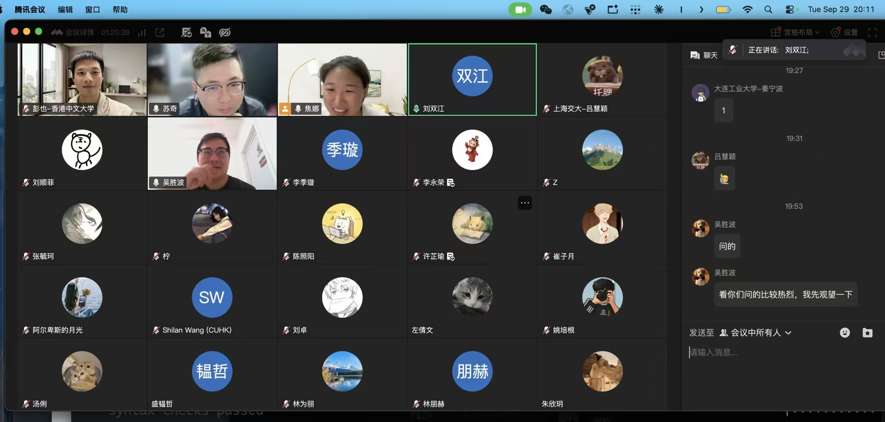

The first session of the **Young Investigators in Microbiome and Health** academic seminar series was held online on 29 September 2026, with a talk by **Qi Su** from The Chinese University of Hong Kong.

## Session details / 活动信息

- **报告题目：** 普拉梭菌缓解失眠的机制探索
- **报告人 / Speaker：** 苏奇（Qi Su）博士，香港中文大学内科及药物治疗学系助理教授、博士生导师
- **时间 / Date & time：** 2026 年 9 月 29 日（周二），19:00–21:00（UTC+8）
- **形式 / Format：** 腾讯会议（Tencent Meeting），线上报告
- **主持人 / Hosts：** 焦娜（Na Jiao），复旦大学青年研究员；彭也（Ye Peng），香港中文大学研究助理教授
- **系列 / Series：** 微生物组与健康青年学者联盟 · 青年学者学术交流系列，第一期

## Speaker / 报告人简介

苏奇，香港中文大学内科及药物治疗学系助理教授、博士生导师，研究方向为肠脑轴及粪菌移植。

[University profile / 大学主页](https://www.mect.cuhk.edu.hk/people/qisu.html)

## Abstract / 报告摘要

以下为本期海报所载报告摘要。

失眠常伴随肠道菌群失调，但介导肠-脑通讯的特定微生物代谢物仍不明确。本研究整合了171名受试者（原发性失眠、新冠后失眠及对照）的宏基因组测序、功能通路分析与临床前验证，发现两种失眠亚型均存在普拉梭菌（*Faecalibacterium prausnitzii*）耗竭和L-精氨酸生物合成下降，并伴有皮质醇水平升高。基因组与体外分析证实，*F. prausnitzii* 是L-精氨酸产生的关键微生物贡献者。在慢性轻度应激小鼠模型中，补充 *F. prausnitzii* 或L-精氨酸均可恢复睡眠时长、正常化皮质酮水平，并逆转应激诱导的肠道菌群失调。机制上，L-精氨酸可抑制POMC基因表达，并减弱ACTH刺激的皮质酮释放，提示POMC-ACTH-皮质醇轴是关键作用靶点。该研究揭示了一条由 *F. prausnitzii* 衍生L-精氨酸驱动、经内分泌信号调节睡眠的肠-脑轴通路，为失眠提供了潜在的代谢物治疗策略。

## Event poster / 活动海报

## Session snapshot / 交流现场

本页海报与会议截图由论坛组织者提供。
